En este ejercicio, se construyó un modelo de clases para la capa lógica de una aplicación destinada a gestionar planos arquitectónicos de una prestigiosa compañía de diseño.

Se implementaron las anotaciones necesarias para integrar correctamente el framework Spring y garantizar su funcionamiento adecuado en el contexto de la gestión de planos.

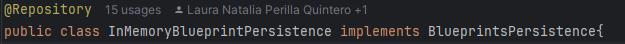

Con el fin de que Spring detectara automáticamente las clases que contienen anotaciones relevantes para la gestión de planos, se desarrolló la clase AppConfig.

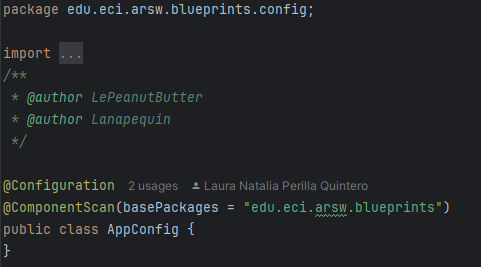

Para permitir la inyección de dependencias en las clases encargadas de la lógica de negocio, se utilizó la anotación @Autowired en la clase BlueprintsServices. De esta forma, InMemoryBlueprintPersistence se inyectó en BlueprintsServices cuando se ejecutó la aplicación.

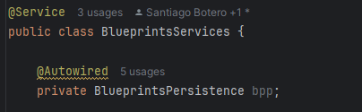

En BlueprintsServices, se delegaron las operaciones relacionadas con los planos a bpp (BluePrintPersistence), mientras que en InMemoryBlueprintPersistence se implementó la lógica de almacenamiento y acceso a los datos mediante un HashMap<Tuple<String, String>, Blueprint>.

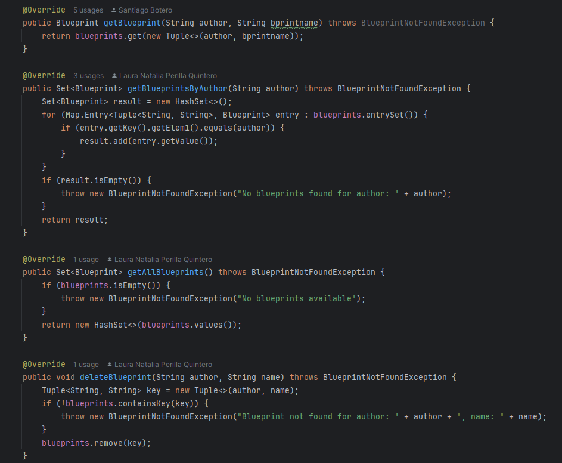

Tras completar la implementación de la lógica, se realizaron las pruebas unitarias correspondientes a InMemoryBlueprintPersistence, las cuales se ejecutaron satisfactoriamente, garantizando que el manejo de los planos fuera correcto.

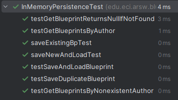

Se crearon los métodos necesarios en InMemoryBlueprintPersistence para registrar, consultar y eliminar planos, con la finalidad de gestionar los planos arquitectónicos a través de las clases superiores.

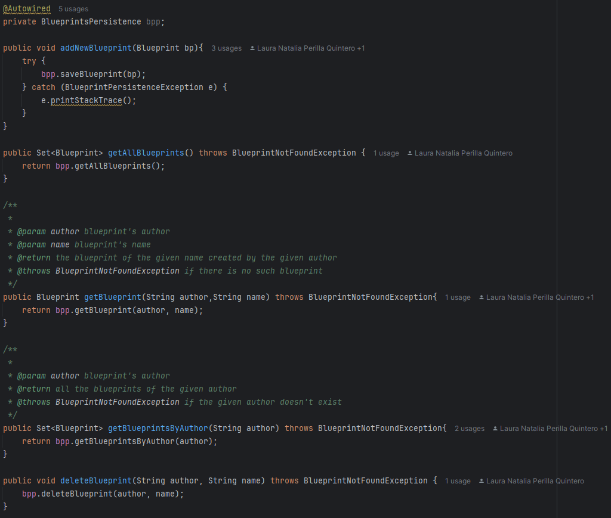

Por último, se implementó la clase Main, que permitió poner en uso estos métodos de gestión de planos y comprobar su correcto funcionamiento dentro de la aplicación.

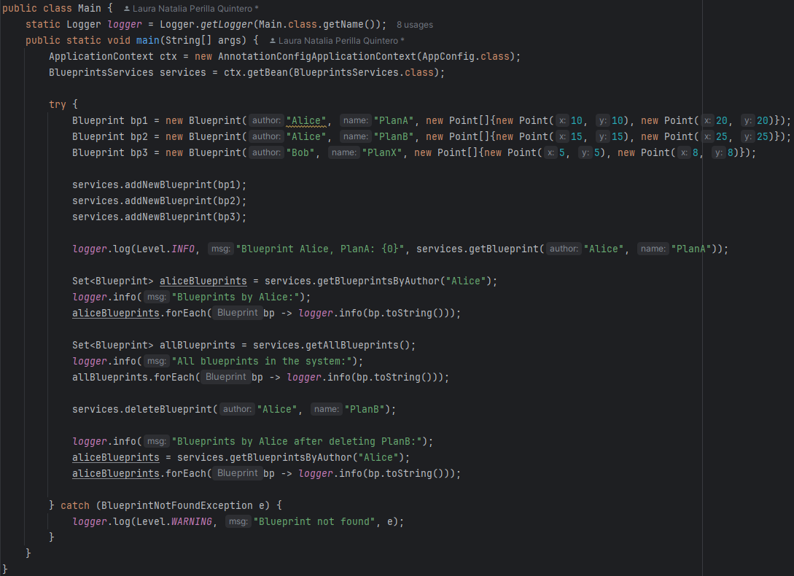

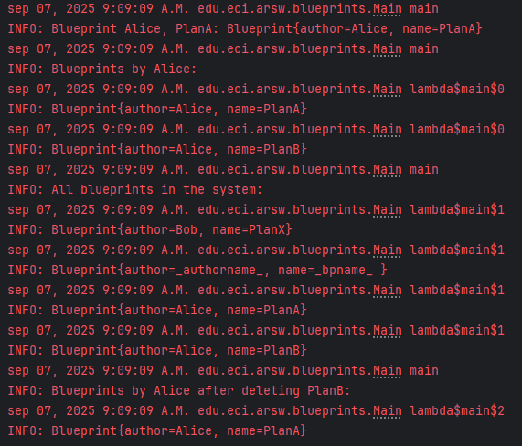

Para abordar las necesidades planteadas, se diseñaron e implementaron dos tipos de filtros que se integrarían a la clase `BlueprintServices`, de modo que pudieran aplicarse de manera intercambiable dependiendo de los requisitos de la consulta.

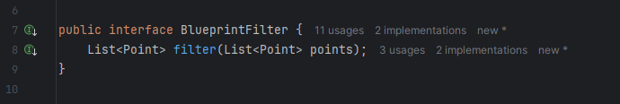

1. **Filtro de Redundancias (A):**

    Este filtro tiene como objetivo eliminar los puntos consecutivos que sean idénticos, ayudando a reducir el tamaño de los planos al eliminar redundancias. Se implementó una clase RedundancyFilter, que aplica esta lógica sobre una lista de puntos de un plano. La clase iterará sobre los puntos, eliminando aquellos que sean consecutivos y tengan las mismas coordenadas.

    Se creó una clase `RedundancyFilter` que implementa una interfaz `BlueprintFilter`. Esta interfaz define un método `filter(List<Point> points)`, que debe ser implementado por todas las clases de filtro.

    En el método filter, se recorren los puntos del plano y se agrega a la lista resultante solo aquellos puntos que no sean iguales al anterior.

    Este filtro se inyectó en la clase BlueprintServices, de modo que, cuando se solicite la consulta de planos, se pueda aplicar dicho filtro para eliminar los puntos redundantes.

    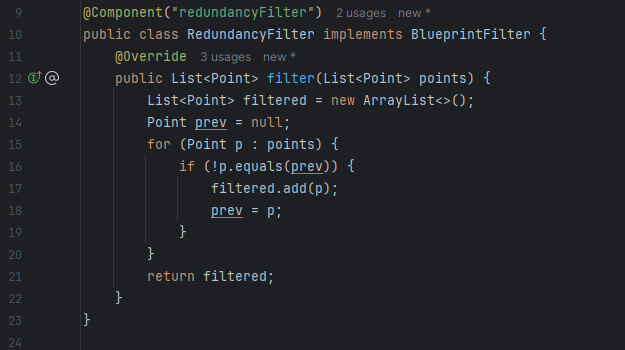

2. **Filtro de Submuestreo (B)**

    El filtro de submuestreo tiene como objetivo reducir el número de puntos en el plano, eliminando uno de cada dos puntos de forma intercalada. Este tipo de filtro puede ser útil en escenarios donde la precisión no es crítica y se busca mejorar el rendimiento al manejar grandes cantidades de datos.

    Se desarrolló una clase `SubsamplingFilter`, que también implementa la interfaz `BlueprintFilter`. La lógica de este filtro consiste en seleccionar solo los puntos en las posiciones pares o impares de la lista, dependiendo de la implementación.

    El método filter en este caso recorre la lista de puntos y agrega al resultado solo los puntos que se encuentren en índices impares o pares.

    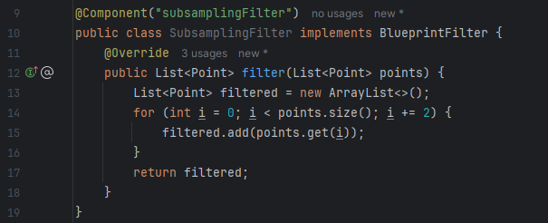

3. **Inyección de los Filtros en la Clase `BlueprintServices`**

   Para que los filtros se puedan aplicar de manera dinámica, fue necesario configurar la inyección de dependencias en la clase `AppConfig`. Se agregó un `@Bean` en esta clase para definir qué filtro será utilizado durante la ejecución de la aplicación.

    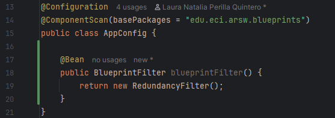

   Además, se modificó la clase `BlueprintServices` para aceptar un filtro como parámetro en su constructor, utilizando la anotación `@Autowired` para que Spring gestione la inyección del filtro correspondiente.

    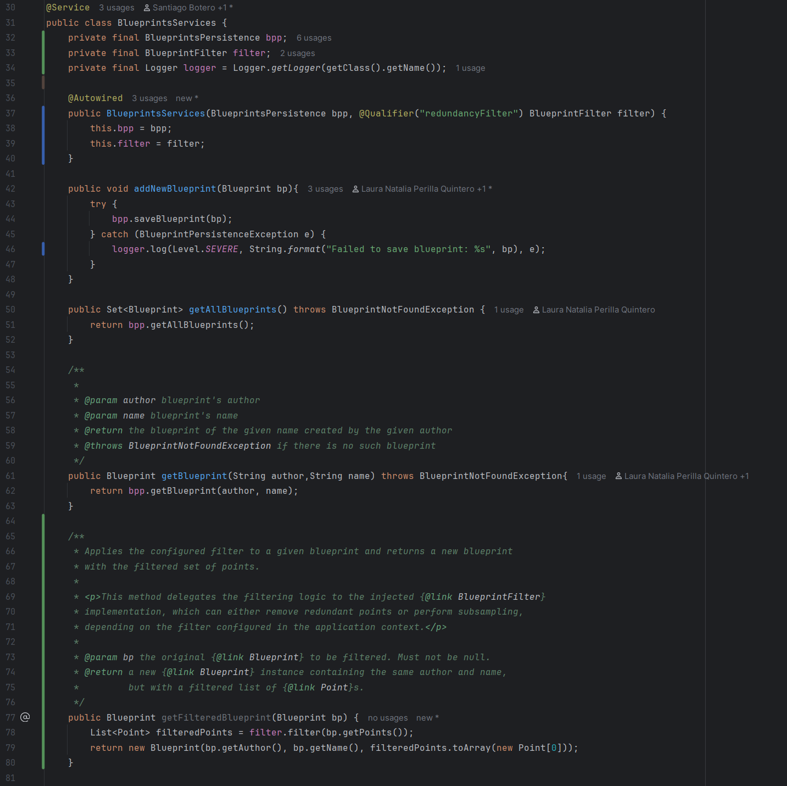

4. **Pruebas Unitarias**

    En el contexto de las pruebas, fue necesario incluir `spring-test` en el archivo `pom.xml` para habilitar las pruebas unitarias y asegurar que la inyección de dependencias y el funcionamiento de los filtros se realizaran correctamente.

    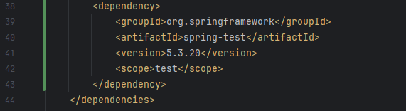
    
    Se desarrollaron pruebas unitarias específicas para verificar que ambos filtros funcionaran correctamente. Cada filtro se probó individualmente para asegurar que se aplicara correctamente y redujera los puntos según el comportamiento esperado.
    
    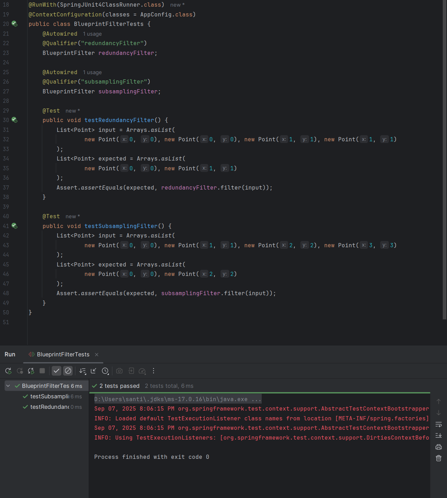