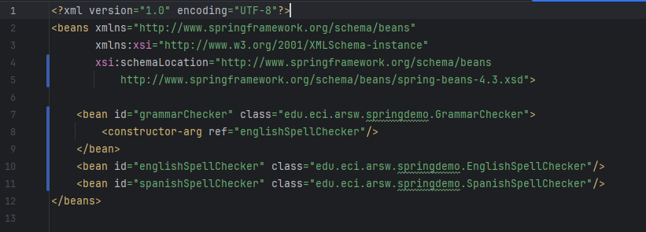
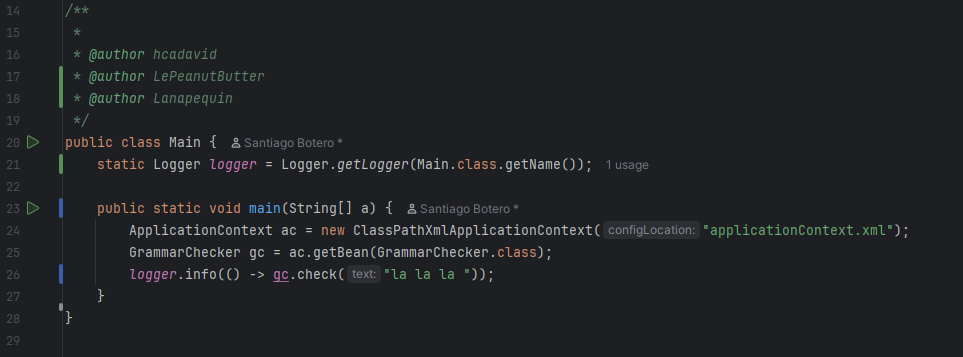
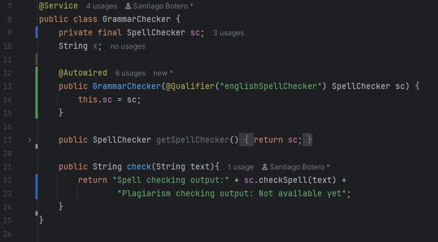
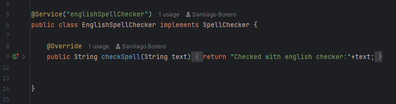
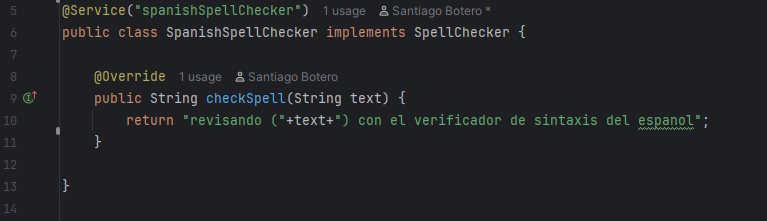
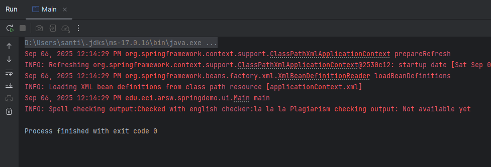
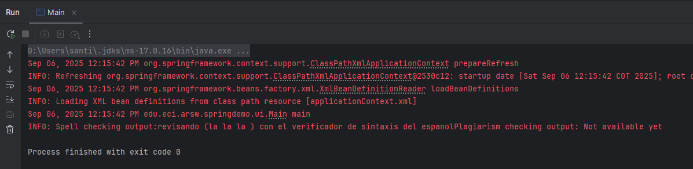

# Inversión de Dependencias, Contenedores Livianos e Inyección con Spring Framework

## Integrantes
- Laura Natalia Perilla Quintero - [Lanapequin](https://github.com/Lanapequin)
- Santiago Botero Garcia - [LePeanutButter](https://github.com/LePeanutButter)

## Taller – Principio de Inversión de dependencias, Contenedores Livianos e Inyección de dependencias.

Antes de abordar el desarrollo del ejercicio Parte I. - Diseño de Componentes y Conectores con Inyección de Dependencias en Spring, se realizó este taller introductorio con el objetivo de familiarizarse con los conceptos fundamentales del uso de Spring Framework como contenedor liviano, la inyección de dependencias y la aplicación del principio de inversión de dependencias.

Este taller documenta la configuración y prueba de una aplicación Java basada en Spring Framework, que realiza análisis gramatical utilizando correctores ortográficos inyectados dinámicamente. Se utilizó Maven como gestor de dependencias y el entorno IntelliJ IDEA para el desarrollo.

El archivo applicationContext.xml ubicado en `src/main/resources` define el contexto de Spring. Se habilita el escaneo automático de componentes con la siguiente configuración:

Esto permite que Spring detecte clases anotadas con `@Service`, `@Component`, etc., dentro del paquete especificado. Así se evita la necesidad de declarar manualmente cada bean.

La clase principal contiene el método main que inicializa el contexto de Spring y obtiene el bean GrammarChecker para ejecutar la verificación gramatical:

Este fragmento demuestra cómo Spring gestiona la creación e inyección de dependencias automáticamente.

La clase GrammarChecker es el componente central que depende de una implementación de SpellChecker. Se anota con `@Service` para que Spring la registre como bean, y se usa `@Autowired` junto con `@Qualifier` para inyectar la implementación deseada:

sta clase implementa la interfaz SpellChecker y se anota con `@Service("englishSpellChecker")` para que Spring la identifique con ese nombre:

Esta implementación se inyecta inicialmente en GrammarChecker.

Similar a la versión en inglés, esta clase implementa SpellChecker y se registra como bean con nombre específico:

Para usar esta implementación, se debe cambiar el `@Qualifier` en GrammarChecker a "spanishSpellChecker".

La prueba inicial utiliza EnglishSpellChecker como dependencia inyectada. El resultado muestra cómo se analiza el texto usando reglas del idioma inglés.

Tras modificar el `@Qualifier` en GrammarChecker, se inyecta SpanishSpellChecker. El resultado refleja el análisis gramatical bajo reglas del idioma español.

## Parte I. - Diseño de Componentes y Conectores con Inyección de Dependencias en Spring

El ejercicio se debe traer terminado para el siguiente laboratorio (Parte II).

#### Middleware- gestión de planos.

## Antes de hacer este ejercicio, realice [el ejercicio introductorio al manejo de Spring y la configuración basada en anotaciones](https://github.com/ARSW-ECI/Spring_LightweightCont_Annotation-DI_Example).

En este ejercicio se va a construír un modelo de clases para la capa lógica de una aplicación que permita gestionar planos arquitectónicos de una prestigiosa compañia de diseño. 

1. Configure la aplicación para que funcione bajo un esquema de inyección de dependencias, tal como se muestra en el diagrama anterior.

    Lo anterior requiere:

    * Agregar las dependencias de Spring.
    * Agregar la configuración de Spring.
    * Configurar la aplicación -mediante anotaciones- para que el esquema de persistencia sea inyectado al momento de ser creado el bean 'BlueprintServices'.

2. Complete los operaciones getBluePrint() y getBlueprintsByAuthor(). Implemente todo lo requerido de las capas inferiores (por ahora, el esquema de persistencia disponible 'InMemoryBlueprintPersistence') agregando las pruebas correspondientes en 'InMemoryPersistenceTest'.

3. Haga un programa en el que cree (mediante Spring) una instancia de BlueprintServices, y rectifique la funcionalidad del mismo: registrar planos, consultar planos, registrar planos específicos, etc.

4. Se quiere que las operaciones de consulta de planos realicen un proceso de filtrado, antes de retornar los planos consultados. Dichos filtros lo que buscan es reducir el tamaño de los planos, removiendo datos redundantes o simplemente submuestrando, antes de retornarlos. Ajuste la aplicación (agregando las abstracciones e implementaciones que considere) para que a la clase BlueprintServices se le inyecte uno de dos posibles 'filtros' (o eventuales futuros filtros). No se contempla el uso de más de uno a la vez:
    * (A) Filtrado de redundancias: suprime del plano los puntos consecutivos que sean repetidos.
    * (B) Filtrado de submuestreo: suprime 1 de cada 2 puntos del plano, de manera intercalada.

5. Agrege las pruebas correspondientes a cada uno de estos filtros, y pruebe su funcionamiento en el programa de prueba, comprobando que sólo cambiando la posición de las anotaciones -sin cambiar nada más-, el programa retorne los planos filtrados de la manera (A) o de la manera (B). 
